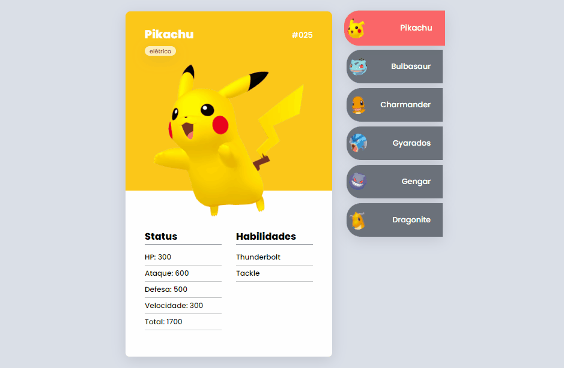
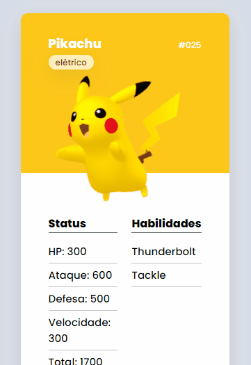

# Pokédex JS
## Pokédex usando JavaScript, HTML e CSS

- <a href="https://kellysondias.github.io/pokedex/">Ver página</a>

## Versão mobile

- <a href="https://kellysondias.github.io/pokedex/">Ver página</a>

## Tecnologias utilizadas:
- HTML
- CSS
- JavaScript
